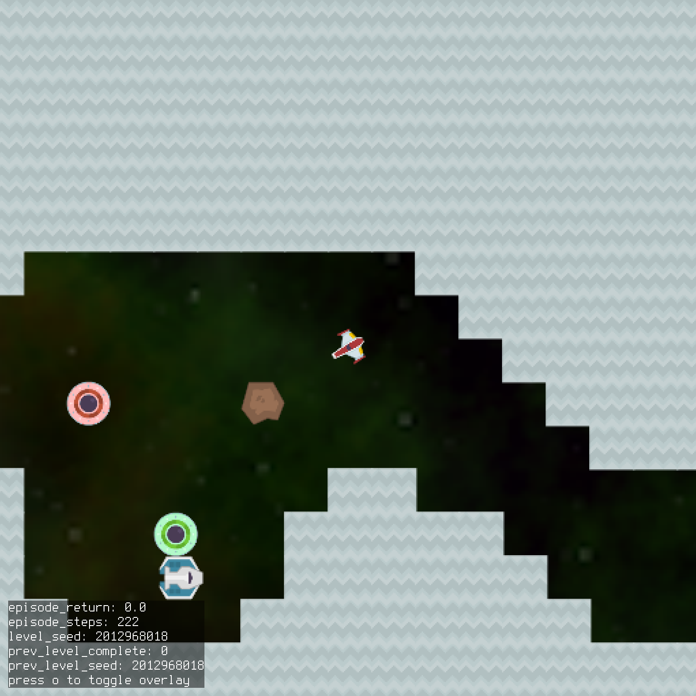
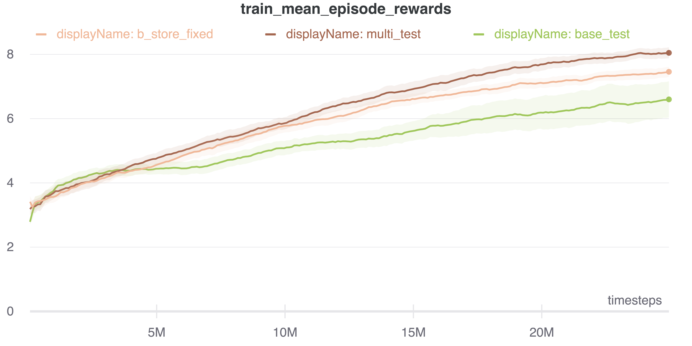
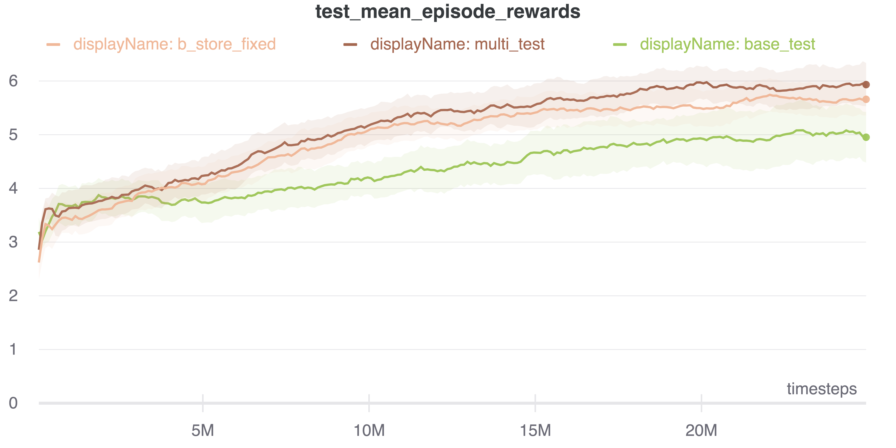

# HIPPO: Human-Involved Proximal Policy Optimisation 
Reinforcement Learning MSc Project with UCL DARK

WORK IN PROGRESS

HIPPO interleaves environment-learning steps with demonstration-learning steps to improve the performance of PPO. 
The algorithm learns to decide when to learn from a demonstration, and what the demonstration should be of. We aim to 
increase the efficiency of RL while enabling better generalisation.


 

We use the OpenAI Procgen Benchmark. Results are shown below.

To train vanilla PPO on Caveflyer, easy mode, 200 levels, with evaluation on all levels:
```
python train.py --name='my_name' --env='caveflyer' --num_timesteps=25000000 --evaluate --num_levels=200
```

To train with HIPPO using the same settings, using a synthetic oracle located in `my_path`:
```
python train.py --name='my_name' --env='caveflyer' --num_timesteps=25000000 --evaluate --num_levels=200 --oracle_path='my_path'
```

Additional arguments can be found in `common/arguments.py`.

##Performance


Performance on Caveflyer, using a continuous stream of new demonstrations (Easy, 200 Levels)

Pink: Demonstration-learning step every 5 environment-learning steps
Brown: Demonstration-learning step every 10 environment-learning steps
Purple: Demonstration-learning step every 100 environment-learning steps
Green: PPO Baseline 





Performance on Caveflyer, using 200 pre-loaded demonstrations only (Easy, 200 Levels)

Brown: Demonstration-learning step every 10 environment-learning steps, continuous stream
Orange: Demonstration-learning step every 10 environment-learning steps, fixed store
Green: PPO Baseline 


